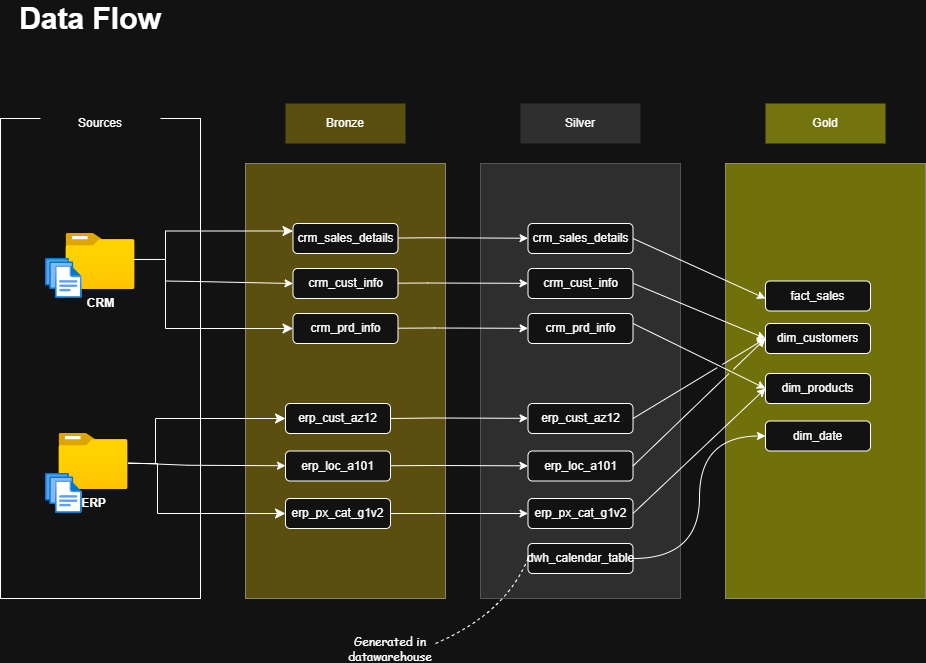

# Modern E-Commerce Data Warehouse for Growth & Customer Analytics
This project demonstrates an end-to-end data lifecycle for an e-commerce retail business, transforming raw operational data into analytics-ready insights that support strategic, data-driven decision-making.

Data is ingested from multiple source systems and processed through structured ETL pipelines within a modern SQL Server–based data warehouse, following the Medallion Architecture (Bronze, Silver, Gold). Each layer incrementally improves data quality, structure, and usability, resulting in a clean, business-ready analytical model.

The curated data is analyzed using SQL and Power BI to understand customer behavior, product performance, and sales trends across a diverse product catalog. These insights enable the business to evaluate growth dynamics, identify revenue drivers, and make informed decisions around customer acquisition strategy, pricing, and investment allocation, supporting effective and sustainable business growth.

---
## 🏗️ Data Architecture

The data architecture for this project follows Medallion Architecture **Bronze**, **Silver**, and **Gold** layers:



/* Data was generated as result of business process of a E-commerce web based retailer which specializes on selling products related to
sports such as bikes, clothings, gears and so on.
The data is stored in the DataWarehouse database which follows a medallion architecture.
The cleaned and analysis ready data is stored in the gold layer of the databse, as 3 objects or views.
- dim.customers
- dim.products
- fact_sales


1. **Bronze Layer**: Stores raw data as-is from the source systems. Data is ingested from CSV Files into SQL Server Database.
2. **Silver Layer**: This layer includes data cleansing, standardization, and normalization processes to prepare data for analysis.
3. **Gold Layer**: Houses business-ready data modeled into a star schema required for reporting and analytics.

---
## 📖 Project Overview

This project involves:

1. **Data Architecture**: Designing a Modern Data Warehouse Using Medallion Architecture **Bronze**, **Silver**, and **Gold** layers.
2. **ETL Pipelines**: Extracting, transforming, and loading data from source systems into the warehouse.
3. **Data Modeling**: Developing fact and dimension tables optimized for analytical queries.
4. **Analytics & Reporting**: Creating SQL-based reports and dashboards for actionable insights.
   

---

## 🛠️ Important Links & Tools:

- **[Datasets](datasets/):** Access to the project dataset (csv files).
- **[SQL Server Express](https://www.microsoft.com/en-us/sql-server/sql-server-downloads):** Lightweight server for hosting your SQL database.
- **[SQL Server Management Studio (SSMS)](https://learn.microsoft.com/en-us/sql/ssms/download-sql-server-management-studio-ssms?view=sql-server-ver16):** GUI for managing and interacting with databases.
- **[Git Repository](https://github.com/):** Set up a GitHub account and repository to manage, version, and collaborate on your code efficiently.
- **[DrawIO](https://www.drawio.com/):** Design data architecture, models, flows, and diagrams.
- **[Notion](https://www.notion.com/templates/sql-data-warehouse-project):** Get the Project Template from Notion.

---

## 🚀 Project Requirements

### Building the Data Warehouse (Data Engineering)

#### Objective
Develop a modern data warehouse using SQL Server to consolidate sales data, enabling analytical reporting and informed decision-making.

#### Specifications
- **Data Sources**: Import data from two source systems (ERP and CRM) provided as CSV files.
- **Data Quality**: Cleanse and resolve data quality issues prior to analysis.
- **Integration**: Combine both sources into a single, user-friendly data model designed for analytical queries.
- **Scope**: Focus on the latest dataset only; historization of data is not required.
- **Documentation**: Provide clear documentation of the data model to support both business stakeholders and analytics teams.

---

### BI: Analytics & Reporting (Data Analysis)

#### Objective
Develop SQL-based analytics to deliver detailed insights into:
- **Customer Behavior**
- **Product Performance**
- **Sales Trends**

These insights empower stakeholders with key business metrics, enabling strategic decision-making.  

For more details, refer to [docs/requirements.md](docs/requirements.md).

## 📂 Repository Structure
```
data-warehouse-project/
│
├── datasets/                           # Raw datasets used for the project (ERP and CRM data)
│
├── docs/                               # Project documentation and architecture details
│   ├── etl.drawio                      # Draw.io file shows all different techniquies and methods of ETL
│   ├── data_architecture.drawio        # Draw.io file shows the project's architecture
│   ├── data_catalog.md                 # Catalog of datasets, including field descriptions and metadata
│   ├── data_flow.drawio                # Draw.io file for the data flow diagram
│   ├── data_models.drawio              # Draw.io file for data models (star schema)
│   ├── naming-conventions.md           # Consistent naming guidelines for tables, columns, and files
│
├── scripts/                            # SQL scripts for ETL and transformations
│   ├── bronze/                         # Scripts for extracting and loading raw data
│   ├── silver/                         # Scripts for cleaning and transforming data
│   ├── gold/                           # Scripts for creating analytical models
│
├── tests/                              # Test scripts and quality files
│
├── README.md                           # Project overview and instructions
├── LICENSE                             # License information for the repository
├── .gitignore                          # Files and directories to be ignored by Git
└── requirements.txt                    # Dependencies and requirements for the project
```

---
## Queries and Analysis


The data analysis process is structured into five stages:
   - Explore
   - Profile
   - Clean
   - Shape
   - Analysis

**Explore**
In this stage, we aim to understand the origin, storage, and context of the data. Key questions include:
- Where was the data generated?
-  Where is the data stored?
Answer:
The data is generated as part of the business process of an e-commerce retailer that specializes in selling sports-related products, such as bikes, clothing, and gear.
The data is stored in a Data Warehouse using a medallion architecture.
The cleaned and analysis-ready data resides in the Gold layer, organized as the following objects:
 - dim.customers
- dim.products
- fact_sales

**Profile**
In this stage, we assess the quality and characteristics of the data to understand its usability. Key questions include:
- What domain does the data/business fall under?
- What are the distributions and uniqueness of the records?


This section summarizes the key insights derived from the sales and customer data analysis for the e-commerce business:

**1. Business Model Insight**

The annual repurchase rate is only 1.88%, which is far below the 40% threshold.

This indicates the business operates in acquisition mode: most customers make one-time purchases, and repeat buying is rare.

Implication: The company should prioritize customer acquisition campaigns over loyalty programs.

**2. Customer Acquisition Patterns**

Historical data shows that a large proportion of annual customers are new:

For example, in 2013, 71.85% of active customers were new.

Insight: The business relies heavily on acquiring new customers each year to sustain growth.

**3. New Customer Growth Trends**

Year-over-year (YoY) growth analysis shows:

Rapid growth in new customers from 2010–2013.

Apparent decline in 2014 due to partial-year data.

Insight: Focus on complete-year trends or YTD growth to avoid misleading interpretations.

**4. Key Business Metric Recommendation**

New Customer Growth (YoY) should be tracked as the primary business metric, as it:

Monitors overall business growth.

Evaluates marketing effectiveness.

Identifies seasonal or annual trends in customer acquisition.

**5. Strategic Implications**

Focus resources on:

Marketing campaigns that attract new customers.

Optimizing pricing and product offerings to maximize first-time purchases.

Avoid investing heavily in loyalty programs that are unlikely to yield returns due to low repurchase rates.

## 🛡️ License

This project is licensed under the [MIT License](LICENSE). You are free to use, modify, and share this project with proper attribution.
