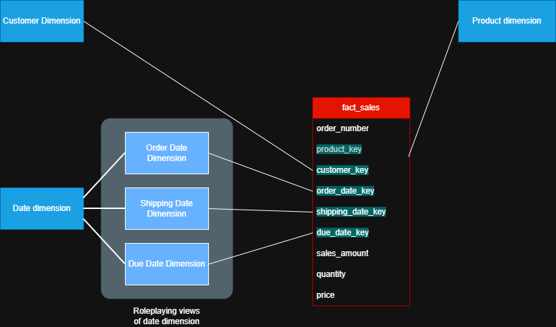
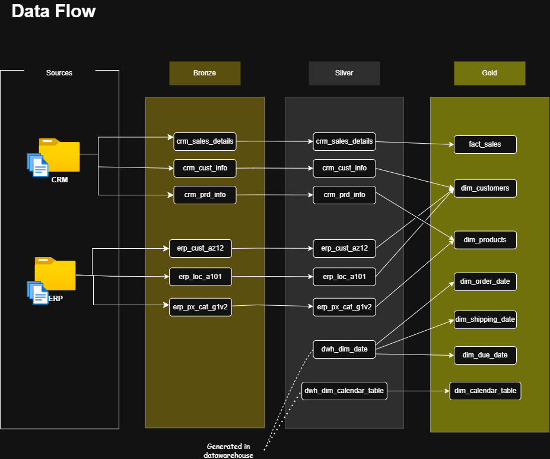

# Modern Retail & Order Management Data Warehouse using SQL Server

---

## 📌 Project Overview

This project delivers a modern **Retail & Order Management Data Warehouse** for a company selling bicycles, sports clothing, and related components across multiple international markets.

The business operates in a retail / e-commerce model, managing:

- Customer orders  
- Product catalogs  
- Pricing and quantities  
- Fulfillment timelines  

The data warehouse supports:

- Sales performance analysis  
- Customer behavior and segmentation  
- Product and category-level reporting  
- Order lifecycle tracking (order, shipping, due dates)  

The primary analytical model is implemented as a **Star Schema** with a role-playing Date dimension.  
An alternative **Snowflake Schema** version is included separately for hierarchical normalization and global modeling scenarios.

---

# 🗂️ Data Sources

The warehouse integrates enterprise-style CRM and ERP systems.

## 1️⃣ CRM (Customer Relationship Management)

Provides customer master data:

- Customer identifiers and business keys  
- Personal attributes (name, gender, marital status)  
- Customer creation and lifecycle details  

Supports:

- Customer profiling  
- Segmentation  
- Retention analysis  

---

## 2️⃣ ERP (Enterprise Resource Planning)

Provides operational and transactional data.

### Product Master Data
- Product name  
- Cost  
- Product line  
- Category and subcategory  
- Lifecycle dates  

### Sales & Order Transactions
- Order numbers  
- Line-level sales data  
- Order, shipping, and due dates  
- Sales amounts, quantities, pricing  

### Customer Demographics & Geography
- Birth date  
- Gender  
- Country and location  

Enables full order-to-delivery lifecycle analysis.

---

# 🌍 Geographic Coverage

Customers operate across:

- Canada  
- United States  
- United Kingdom  
- Germany  
- France  
- Australia  

Supports regional and country-level reporting.

---
# Data Warehouse / Business Intelligence System Requirements

1️⃣ The DW/BI System must make information easily accessible

The data’s structures and labels should mimic the business users’ thought processes and vocabulary.

**simple and fast**

2️⃣ The DW/BI system must present information consistently.

Data must be assembled from a variety of sources, cleansed, quality assured, and released only when it is fit for user consumption.

Ensure common labels and definitions for the DW/BI system’s contents are used across data sources.

3️⃣ The DW/BI system must adapt to change.

4️⃣ The DW/BI system must present information in a timely way.

5️⃣ The DW/BI system must be a secure bastion that protects the information assets.

6️⃣ The DW/BI system must serve as the authoritative and trustworthy foundation for improved decision making.

7️⃣ The business community must accept the DW/BI system to deem it successful.

# 🏗️ Stage 1 – Data Warehouse (Medallion Architecture)

The warehouse follows a structured **Bronze → Silver → Gold** architecture.

## Architecture Diagram

---

## 🔹 Bronze Layer
- Raw CSV ingestion from CRM and ERP  
- No transformations  
- Preserves source fidelity and traceability  

## 🔹 Silver Layer
- Data cleansing  
- Standardization  
- Deduplication  
- Conformed reference data (including unified date dimension)  

## 🔹 Gold Layer
- Business-ready star schema  
- Fact and conformed dimension tables  
- Optimized for analytical queries and Power BI  

**Benefit:**  
Incremental data quality improvement, simplified maintenance, and scalable analytics.

---

# ⭐ Dimensional Design Process

**Why dimensional Modelling?**

**Deliver data that’s understandable to the business users.**

**Deliver fast query performance.** 

The dimensional model follows Kimball’s structured four-step approach.

---

## 1️⃣ Select Business Process

Retail sales and order management — covering:

- Order placement  
- Fulfillment  
- Delivery timelines  

---

## 2️⃣ Declare Grain

**Fact Table Grain:**

> One row represents one product purchased by one customer within a single sales order (order line item level).

This supports:

- Product-level analysis  
- Customer purchasing behavior  
- Transaction-level revenue tracking  

---

## 3️⃣ Identify Dimensions

### 🟢 Product Dimension
Derived from ERP:

- Product name  
- Product line  
- Category & subcategory  
- Lifecycle dates  

### 🟢 Customer Dimension
Derived from CRM & ERP:

- Customer identifiers  
- Demographics  
- Country  

### 🟢 Date Dimension (Role-Playing)

A single conformed `dim_date` reused as:

- Order Date  
- Shipping Date  
- Due Date  

Ensures consistent time intelligence without duplication.

---

## 4️⃣ Identify Facts

The central `fact_sales` table includes:

- Sales amount  
- Quantity sold  
- Unit price  

Enables:

- Revenue analysis  
- Product performance  
- Sales trends over time  

---

## 📊 Star Schema Model

---

## 📋 Fact Table Structure

---

## 🔄 Data Flow

---

# ❄️ Snowflake Schema (Alternative Model)

A normalized dimensional version is available under:

This model:

- Separates hierarchical attributes (e.g., category structures)  
- Reduces redundancy  
- Handles global hierarchy complexity  

The Star Schema remains the primary analytical model.

---

# 📈 Stage 2 – SQL-Based Data Analysis

The analysis process follows five structured stages:

1. Explore  
2. Profile  
3. Clean  
4. Shape  
5. Analyze  

---

## SQL Workflow

---

## Analytical Focus Areas

- Customer behavior analysis  
- Product performance evaluation  
- Revenue and growth trends  
- Time-series and seasonal analysis  

Many data quality improvements are already handled in the ETL layer, ensuring SQL analysis starts from curated datasets.

---

# 📊 Stage 3 – Power BI Visualization

The Gold-layer Star Schema connects directly to Power BI, enabling:

- KPI dashboards  
- Interactive drill-down reports  
- Customer segmentation  
- Regional comparisons  
- Trend analysis  

**Outcome:**  
Clear, interactive business intelligence for pricing, promotions, and growth strategy.

---

# 📂 Repository Structure

---

# 🛠️ Tools & Technologies

- SQL Server Express  
- SQL Server Management Studio (SSMS)  
- Power BI  
- Draw.io  
- Git / GitHub  

---

# 📜 License

This project is licensed under the MIT License.

