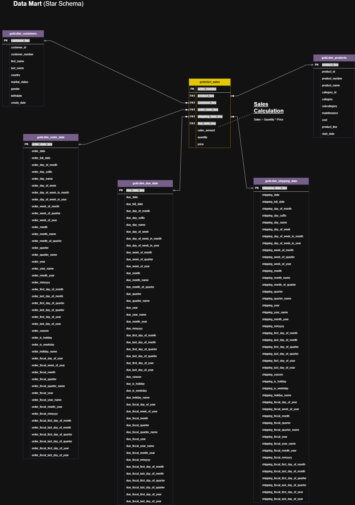
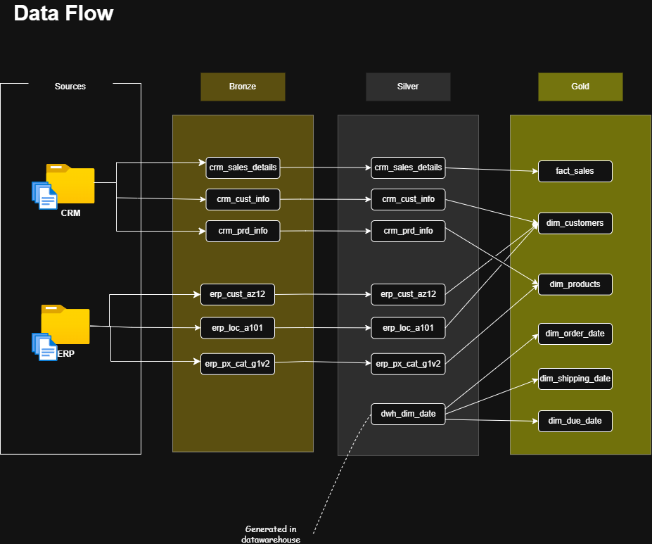
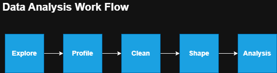

# 🏬 Modern Retail & Order Management Data Warehouse  
**SQL Server | Dimensional Modeling | Medallion Architecture | Power BI**

---

## 📌 Project Overview

This project delivers a modern **Retail & Order Management Data Warehouse** supporting a company selling bicycles, sports clothing, and related components across international markets.

The solution integrates CRM and ERP systems into a structured, analytics-ready platform designed for:

- Sales performance reporting  
- Customer behavior analysis  
- Product and category insights  
- Order lifecycle tracking (order, shipping, due dates)  
- Regional and country-level comparisons  

The warehouse is built using:

- **Dimensional Modeling (Star Schema)**
- **Medallion Architecture (Bronze → Silver → Gold)**
- **SQL-based transformations**
- **Power BI integration**

The system balances performance, governance, scalability, and business usability.

---

# 🌍 Geographic Coverage

Customers operate across:

- Canada  
- United States  
- United Kingdom  
- Germany  
- France  
- Australia  

Supports multi-country reporting.

---

# 🗂️ Data Sources

The data warehouse consolidates operational data from two enterprise systems: **CRM** and **ERP**.  
Each system contributes distinct business capabilities that are integrated and conformed in the warehouse.

---

## 1️⃣ Customer Relationship Management (CRM)

The CRM system is the primary source of **customer master data and transactional references**.

### Core Contributions

#### 🔹 Customer Master Data
- Customer identifiers (business keys)
- Customer creation details
- Core personal attributes

**Purpose in the DW:**
- Forms the base of the `dim_customer`
- Establishes consistent customer grain
- Supports customer lifecycle tracking

---

#### 🔹 Sales Transaction References
- Customer-product relationships
- Order-level transactional identifiers

**Purpose in the DW:**
- Contributes to `fact_sales`
- Defines the transactional grain (order line level)
- Enables revenue attribution to customers and products

---

#### 🔹 Product Reference Data
- Product identifiers
- Current and historical product attributes

**Purpose in the DW:**
- Contributes to `dim_product`
- Maintains product integrity across transactions

---

## 2️⃣ Enterprise Resource Planning (ERP)

The ERP system enriches CRM data with **operational, demographic, and hierarchical business context**.

### Core Contributions

#### 🔹 Customer Demographics
- Birth date
- Additional customer attributes

**Purpose in the DW:**
- Enhances `dim_customer`
- Enables age-based segmentation and behavioral analysis

---

#### 🔹 Geographic Information
- Country and location attributes

**Purpose in the DW:**
- Enables regional and country-level reporting
- Supports geographic performance comparison

---

#### 🔹 Product Hierarchy
- Product line
- Category and subcategory structures

**Purpose in the DW:**
- Enhances `dim_product`
- Enables category roll-ups and hierarchical analysis

---

---

# 🚀 Core Data Warehouse Features

---

## ⭐ 1. Dimensional Modeling – Star Schema

The analytical layer is implemented using a Star Schema, optimized for reporting and BI workloads.

Structure

Central fact table: fact_sales

Conformed dimension tables:

dim_customer

dim_product

dim_date (physical table for storage)

Role-playing dimension views:

dim_order_date

dim_shipping_date

dim_due_date

### Declared Grain

> One row represents one product purchased by one customer in a single order (order line item level).

This supports precise revenue tracking and customer-level analysis.

### Business & Technical Benefits

| Benefit | Impact |
|----------|--------|
| High Query Performance | Fewer joins and denormalized dimensions |
| Business Readability | Model aligns with stakeholder reporting needs |
| BI Tool Compatibility | Seamless Power BI integration |
| Scalability | New dimensions and metrics can be added easily |

Supports analysis such as:

- Revenue by category and region  
- Customer purchasing patterns  
- Seasonal sales trends  
- Order fulfillment cycle analysis

---

## 📊 2. Facts and Dimensions – Analytical Integrity

The design strictly separates measurable events from descriptive attributes.

### 🔹 Fact Table – `fact_sales`

Contains measures:

- `sales_amount` (fully additive)
- `quantity` (fully additive)
- `unit_price` (non-additive snapshot attribute)

**Measure Behavior:**

- `sales_amount` → Fully additive across all dimensions  
- `quantity` → Fully additive across all dimensions  
- `unit_price` → Non-additive (cannot be summed meaningfully)

`unit_price` is stored at the order-line grain to preserve historical pricing at the time of transaction.  
It is used for:

- Margin calculations  
- Average selling price (AVG) analysis  
- Price trend analysis over time  

It is **not** intended to be aggregated using SUM, as summing prices produces invalid business meaning.

---

**Facts:**

- Drive KPIs and revenue metrics  
- Support aggregation of additive measures  
- Enable time-series and performance analysis  
- Represent measurable business events at defined grain  

---

### 🔹 Dimension Tables

Contain descriptive attributes such as:

- Product hierarchy (category, subcategory)
- Customer demographics
- Geographic attributes
- Calendar hierarchies

**Dimensions:**

- Used for filtering and grouping
- Enable drill-down analysis
- Define analytical constraints
- Support segmentation

### Modeling Discipline Applied

- No additive business metrics stored in dimension tables  
- Clear fact grain declaration  
- Surrogate key implementation  
- Controlled handling of non-additive attributes  

Prevents:

- Double counting  
- Aggregation ambiguity  
- Reporting inconsistencies  

---

## 🏗️ 3. Medallion Architecture (Bronze → Silver → Gold)

The warehouse follows a structured layered architecture.

---

### 🔹 Bronze Layer – Raw Ingestion

- Raw CSV ingestion from CRM and ERP  
- No transformations  
- Full source traceability  

**Benefit:** Preserves auditability and lineage.

---

### 🔹 Silver Layer – Cleansed & Conformed

- Data standardization  
- Deduplication  
- Data type normalization  
- Conformed reference data (including unified date dimension)  

**Benefit:** Ensures consistent business definitions across systems.

---

### 🔹 Gold Layer – Business-Ready Model

- Star schema implementation  
- Optimized fact and dimension tables  
- Designed for analytical performance  

**Benefits:**

- Clear separation between transformation and reporting logic  
- Scalable data design  
- Stable semantic layer for BI tools  

---
  

---

# 🔄 Data Flow

---

---

# 📈 SQL-Based Data Analysis

The analysis workflow follows:

1. Explore  
2. Profile  
3. Clean  
4. Shape  
5. Analyze  

Focus areas:

- Customer behavior analysis  
- Product performance evaluation  
- Revenue and growth trends  
- Time-series and seasonal analysis  

---

# 📊 Power BI Integration

The Gold-layer Star Schema connects directly to Power BI, enabling:

- KPI dashboards  
- Interactive drill-down reports  
- Customer segmentation  
- Regional comparisons  
- Trend visualization  

**Outcome:** Decision-ready intelligence for pricing, promotions, and growth strategy.

---

# 📂 Repository Structure

---

# 🛠️ Tools & Technologies

- SQL Server Express  
- SQL Server Management Studio (SSMS)  
- Power BI  
- Draw.io  
- Git / GitHub  

---

# 🎯 What This Project Demonstrates

- Dimensional modeling expertise  
- Fact/dimension integrity enforcement  
- Enterprise-style layered architecture  
- Governance-aware warehouse design  
- BI-ready semantic modeling  
- Business-aligned analytical thinking  

This solution delivers a secure, scalable, and performance-optimized analytical foundation.

---

# 📜 License

This project is licensed under the MIT License.

